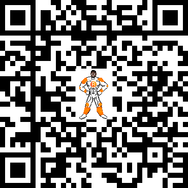

# 🐇 The Bitcoin Rabbit Hole 🐇

👋🏽 Welcome to the Bitcoin Rabbit Hole! 
 
 

This is a guide designed to help you learn what bitcoin is, how it works, and much more. You can learn as much or as little as you'd like. The journey is entirely yours!

- If you have Notion, you can duplicate this guide into your workspace to interact with it.
- Markdown version and code can be found here [here](https](https://github.com/thecallousedcoin/buddylasta/blob/gh-pages/markdown/The-Bitcoin-Rabbit-Hole-Guide.md))
- Pdf version (pdf) of this guide can be downloaded [here](https://www.buddylasta.com/pdfs/The-Bitcoin-Rabbit-Hole-Guide.pdf).
- Excel version (xlsx) version of this guide can be downloaded [here](https://www.buddylasta.com/xlsx/The-Bitcoin-Rabbit-Hole-Guide.xlsx).
- OpenDocument (ods) version of this guide can be downloaded [here](https://www.buddylasta.com/ods/The-Bitcoin-Rabbit-Hole-Guide.ods).

 

## **What is Bitcoin?**

📌 
[Read The Bitcoin Whitepaper](https://www.buddylasta.com/pdfs/bitcoin.pdf) written by bitcoin’s pseudonymous creator, Satoshi Nakamoto. Then check out the Bitcoin Fundamentals page below. After reading through the fundamentals, I recommend building on them with the resources in the “Getting Started” section.

 

- [Bitcoin Fundamentals](../markdown/bitcoin-fundamentals.md)

 

## Getting Started

📌 Just getting started with bitcoin? Work through the to-dos below to gain an understanding of what it is, how it works, and what it solves.

 

- [To Dos](../markdown/bitcoin-to-dos.md)

 

## **Proof of Work**

📌 Bitcoin-related articles, books, podcasts, videos, and additional resources have been curated for you below. Mark a resource as “Done” as proof of the work you've put in to understand bitcoin. Always do your own research. Don't trust everything you read or hear, verify.

 

- [Articles](%F0%9F%90%87%20The%20Bitc%207a7a3/Articles%20dcedb.md)

- [Books To Read](%F0%9F%90%87%20The%20Bitc%207a7a3/Books%20To%20R%20f0b0b.md)

- [Podcasts](%F0%9F%90%87%20The%20Bitc%207a7a3/Podcasts%202558b.md)

- [Videos](%F0%9F%90%87%20The%20Bitc%207a7a3/Videos%200d7f3.md)

- [Additional Resources](%F0%9F%90%87%20The%20Bitc%207a7a3/Additional%206ffcc.md)

 

## **Buy & Earn**

📌 You can purchase bitcoin from exchanges that require your personal information (KYC) or exchanges that do not (noKYC). To understand the tradeoffs click [here](https://bitcoiner.guide/nokyconly/). I highly recommend noKYC. You can also earn bitcoin through work and everyday purchases.

 

- [Stack Sats](%F0%9F%90%87%20The%20Bitc%207a7a3/Stack%20Sats%20a4fe1.csv)

 

## Self-Custody

📌 Once you've purchased bitcoin, it's not rightfully yours until you've taken custody of it. How do you do that? You need to download a bitcoin wallet. Below are recommended mobile, hardware (HWW), and desktop wallet options for on-chain and [Lightning](https://lightning.network/). There are also companies listed below that help you store your bitcoin via [multisig](https://en.bitcoin.it/wiki/Multi-signature) (for retirement as well). Check em out!

 

- [Bitcoin Wallets (Layer 1)](%F0%9F%90%87%20The%20Bitc%207a7a3/Bitcoin%20Wa%20faaca.csv)

- [Lightning Wallets (Layer 2)](%F0%9F%90%87%20The%20Bitc%207a7a3/Lightning%20%20cc92d.csv)

 

## Wallet Backups

📌 A backup is a complete set of information from which your bitcoin can be recovered. If you lose access to your wallet and you have no backup, your bitcoin may be gone forever. This is why you need backups! Read the backup guide below to get started.

 

- [Bitcoin-intro backup guide](https://bitcoin-intro.com/en/backup)

 

## Privacy

> “**Privacy** isn’t about something to hide. **Privacy** is about something to protect.” — Edward Snowden.
> 

📌 Read the privacy resources below to learn how to gain privacy on a bitcoin standard.

 

- [Privacy Resources](%F0%9F%90%87%20The%20Bitc%207a7a3/Privacy%20Re%20b3b1e.csv)

 

## Nodes

📌 A node keeps a historic record of all bitcoin transactions, it validates transactions, and it dictates and enforces the rules of the network. Think of it as your own copy of the bitcoin network that allows you to verify bitcoin is operating as it should be. Check out this [video](https://www.youtube.com/watch?v=D11R0W2uxeM&t=133s) to learn the benefits of running one. You can buy a raspberry pi 4 and flash a particular node's OS on it or you can buy a plug-and-play version. Check out all the options below.

 

- [Nodes](%F0%9F%90%87%20The%20Bitc%207a7a3/Nodes%20540a7.csv)

*Note: I have built or tried almost every node in the list above. Reach out if you need help!*

 

## Mining

📌 Bitcoin miners mine bitcoin, secure the network, and confirm transactions on the network. Read this [article](https://braiins.com/blog/bitcoin-nodes-vs-miners-demystified) for a more in-depth explanation. Check out the information below if you want to buy a miner and start mining!

 

- [Mining](%F0%9F%90%87%20The%20Bitc%207a7a3/Mining%2078771.csv)

 

## Community

📌 This guide will not be enough for your bitcoin journey. You will need members of the community to help you at some point. Many of those members provide help on Telegram, Discord, etc. Check out the communities below and join the ones that suit your needs. DYOR to find more :)

 

- [Communities](%F0%9F%90%87%20The%20Bitc%207a7a3/Communitie%2024f00.csv)

 

## Visualizations & Metrics

📌 Reading about bitcoin isn’t enough. Use the tools below to visualize and analyze it.

 

- [Visualizations & Metrics](%F0%9F%90%87%20The%20Bitc%207a7a3/Visualizat%20d0649.csv)

 

## Setting Up A Bitcoin Business

📌 Businesses are scattering to accept bitcoin and hold it on their balance sheets. The resources below can help your business do just that.

 

- [Business](%F0%9F%90%87%20The%20Bitc%207a7a3/Business%205a2e0.csv)

 

## Spending Bitcoin

📌 Let’s say you want to get on zero fiat and live off of bitcoin. Or you want to be able to spend the bitcoin you have on everyday purchases. How are you going to do it? The services below will help you do just that.

 

- [Spending Bitcoin](%F0%9F%90%87%20The%20Bitc%207a7a3/Spending%20B%20644a2.csv)

*Note: spending bitcoin may incurs taxes...for now ;)*

 

## Tips

📌 If you found this curation of resources valuable, consider donating via [venmo](https://venmo.com/code?user_id=1689644865421312128&created=1644251275), [strike](http://strike.me/buddylasta), [paynym](https://paynym.is/+blackcherry7Ca), [btcpay server](https://btcpay.buddylasta.com/apps/hMgwCNdbsaXz6sfpwMjG6Bif4i8/pos), or by scanning the QR code below. Thank you in advance, I really appreciate it 🤠

 

 

- The goal of this guide was to provide you with resources to help you along your bitcoin journey. There are hundreds more resources out there. DYOR to find them! One day, create and share your own!
- I’m slowly adding more of my work to my website [buddylasta.com](https://www.buddylasta.com/). Check it out!